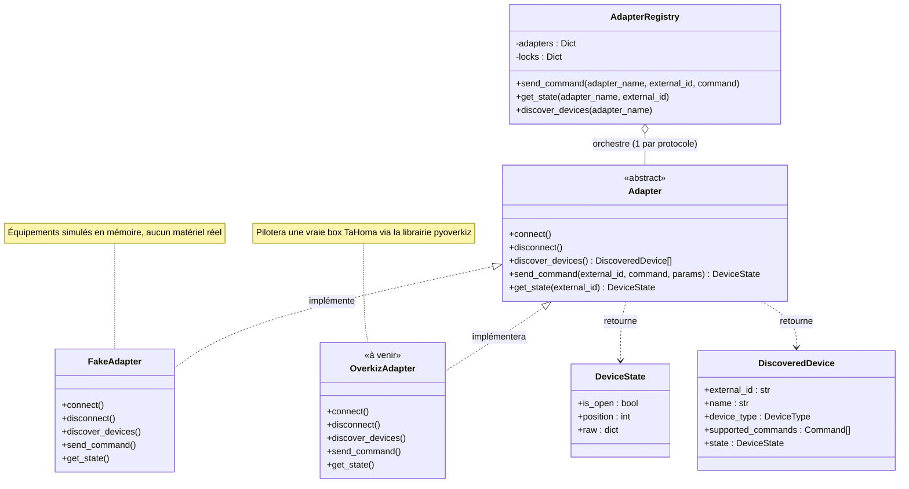
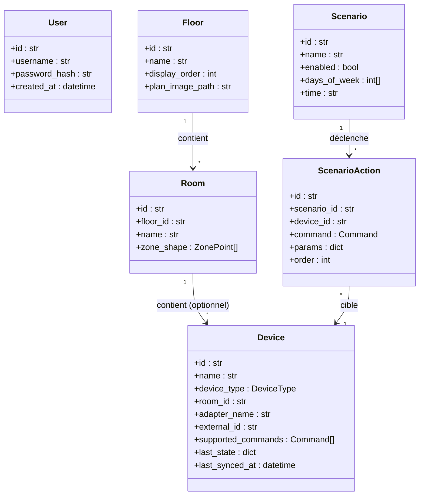
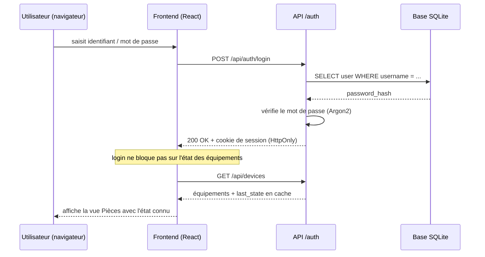
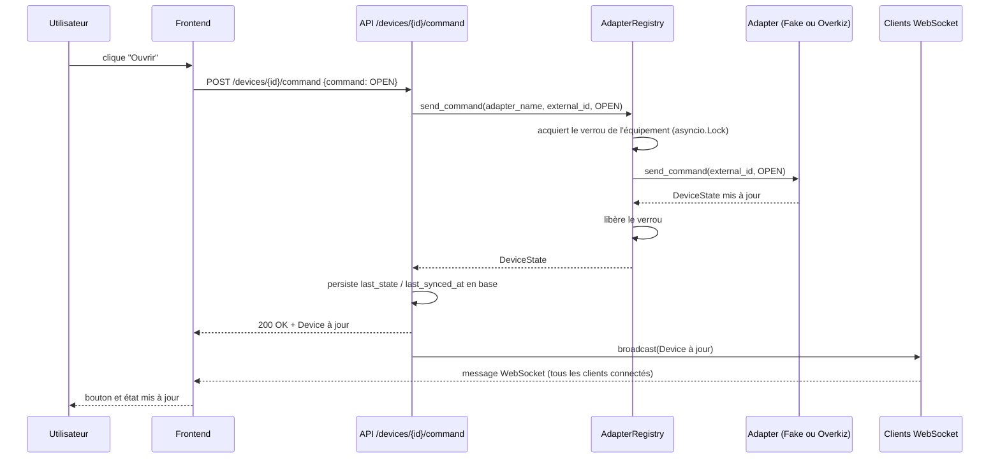
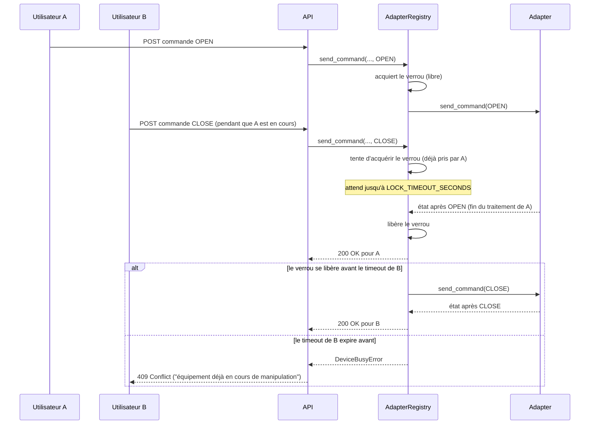

# Domotique — Diagrammes de classes et de séquence

Voir `SPEC.md` pour la présentation fonctionnelle. Ces diagrammes sont en Mermaid — lisibles directement sur GitHub, dans VS Code (extension Markdown Preview Mermaid), ou via n'importe quel rendu Mermaid.

## Diagramme de classes — architecture adaptateurs (`backend/app/core/` + `backend/app/adapters/`)

**Point clé** : `AdapterRegistry` et tout le reste du backend ne connaissent que `Adapter` — jamais `FakeAdapter` ni `OverkizAdapter` directement. Ajouter un protocole = ajouter une classe qui implémente `Adapter`, rien d'autre à modifier.

## Diagramme de classes — modèle de données (`backend/app/models.py`)

**Point clé** : `Device.room_id` est nullable (un équipement découvert peut ne pas encore être rangé dans une pièce) ; `Device.adapter_name` + `Device.external_id` font le lien entre l'équipement tel que connu en base et l'équipement tel que piloté par l'adaptateur.

## Diagramme de séquence — connexion + chargement de la vue Pièces

## Diagramme de séquence — envoi d'une commande (verrouillage + WebSocket)

## Diagramme de séquence — deux commandes concurrentes sur le même équipement

Illustre le comportement de verrouillage : deux utilisateurs cliquant sur le même équipement à quelques centaines de millisecondes d'écart ne partent jamais en parallèle vers l'adaptateur.

